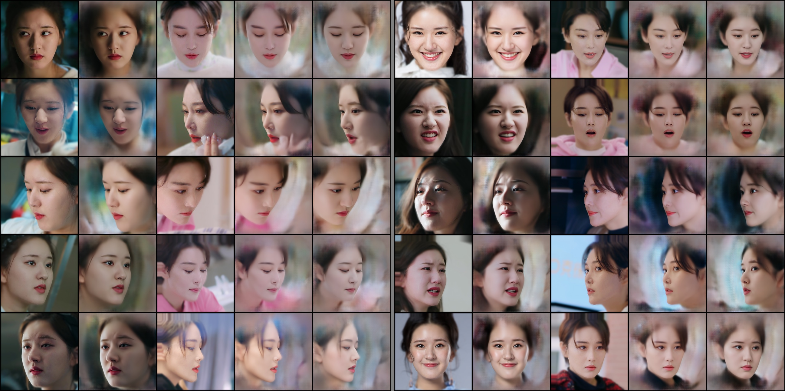
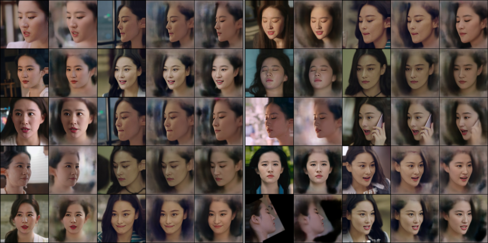

# DeepFaceLab LIAE Face swap 

A simple liae face-swapping implementation, using pytorch, uses the data loader from the original deepfacelab project.

## requirements

- python
- pytorch
- torchvision
- numpy
- opencv-python
- matplotlib
- loguru
- adabelief_pytorch

## usage

Fix the config in `cfg/config.py` and run the following command, **src_aligned_path** and **dst_aligned_path** are required.

```bash
python train.py --config cfg/config.py
```

## Output

You can view the results of your training in the workspace folder.

## visualization


